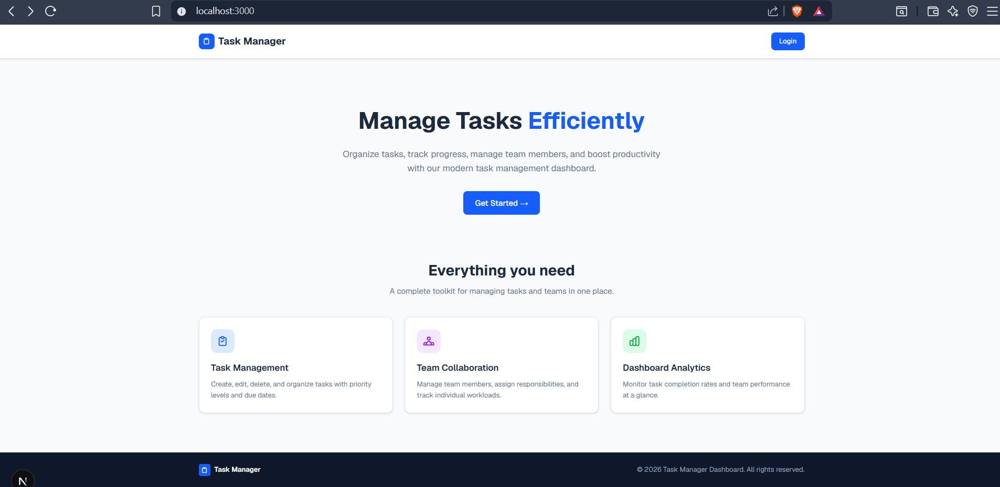
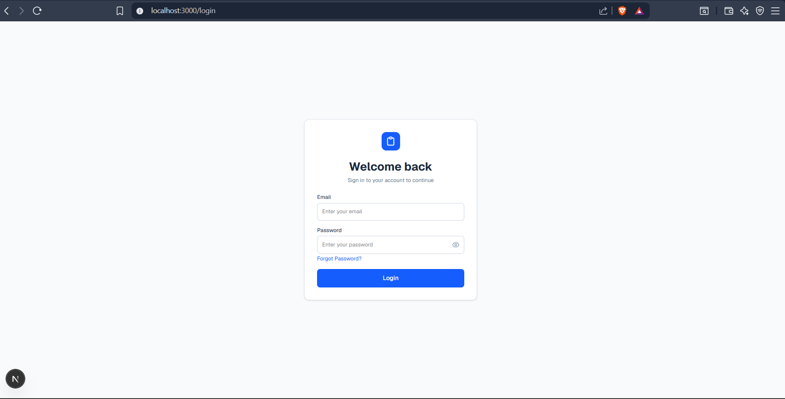
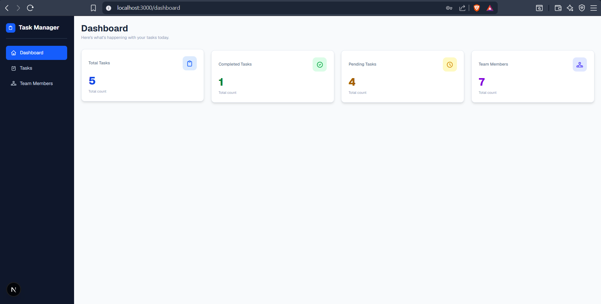
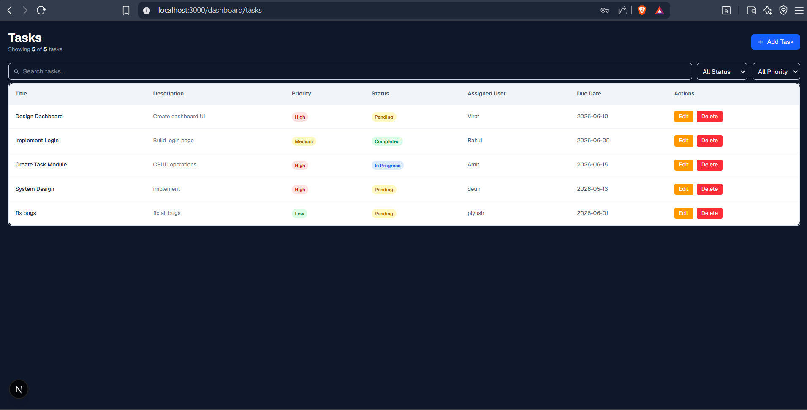
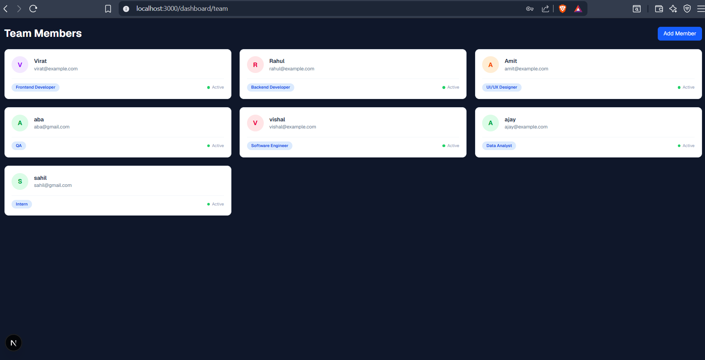

# 🚀 Task Management Dashboard

## Overview
Task Management Dashboard is a modern web application built with Next.js, TypeScript, Tailwind CSS, Redux Toolkit, and Redux Persist. It helps users manage tasks, track progress, and organize team members efficiently.

## Features
1. Authentication
* Login Page
* Forgot Password Page
* Form Validation using Zod

2. Dashboard
* Total Tasks Statistics
* Completed Tasks Statistics
* Pending Tasks Statistics
* Team Member Statistics

3. Task Management
* Create Task
* Edit Task
* Delete Task
* Search Tasks
* Filter by Status
* Filter by Priority

4. Team Management
* Add Team Members
* View Team Members

5. Additional Features
* Redux Toolkit State Management
* Redux Persist Data Persistence
* Toast Notifications
* Loading States
* Error Handling
* Responsive Design

## Tech Stack
* Next.js 15
* TypeScript
* Tailwind CSS
* Redux Toolkit
* Redux Persist
* React Hook Form
* Zod
* React Hot Toast

## Installation
Clone the repository : git clone <repository-url>

Navigate to the project : cd task-management-dashboard

Install dependencies : npm install

Run the development server : npm run dev

Open : http://localhost:3000

## Screenshots

### Homepage

### LoginPage

### Dashboard

### Tasks

### Team Members

## Folder Structure
task-management-dashboard/
│
├── app/
│   ├── dashboard/
│   │   ├── page.tsx
│   │   ├── tasks/
│   │   │   └── page.tsx
│   │   └── team/
│   │       └── page.tsx
│   │
│   ├── login/
│   │   └── page.tsx
│   │
│   ├── forgot-password/
│   │   └── page.tsx
│   │
│   ├── favicon.ico
│   ├── globals.css
│   ├── layout.tsx
│   └── page.tsx
│
├── components/
│   ├── dashboard/
│   │   └── StatCard.tsx
│   │
│   ├── tasks/
│   │   └── TaskTable.tsx
│   │
│   └── team/
│       └── TeamCard.tsx
│
├── data/
│   ├── members.ts
│   └── tasks.ts
│
├── lib/
│   └── schemas/
│       └── authSchemas.ts
│
├── redux/
│   ├── memberSlice.ts
│   ├── provider.tsx
│   ├── store.ts
│   └── taskSlice.ts
│
├── types/
│   ├── member.ts
│   └── task.ts
│
├── public/
│
├── .gitignore
├── README.md
├── package.json
├── package-lock.json
├── tsconfig.json
├── next.config.ts
├── eslint.config.mjs
└── postcss.config.mjs
